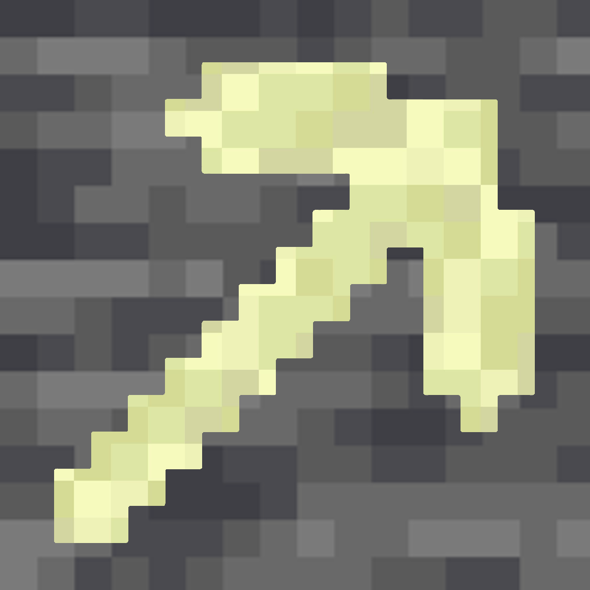

</img>
# Instamine
Mining deepslate has always felt inconsistent. Same tools, same enchants, slower mining speed for no meaningful gameplay reason.

Instamine fixes that by reducing the hardness of **selected blocks** to match the hardness of regular stone. This means with **Efficiency V & Haste II**, affected blocks become practically instamineable, just like stone.

## Features
- Makes **deepslate** and **endstone**  instamineable out of the box
- Fully customizable block list through the **Mod Menu** mod or the config file
- Configurable target hardness for those who have other things in mind
- Works server-side without requiring clients to install the mod

## Dependencies

#### Latest Release
- Required: <a href="https://modrinth.com/mod/cloth-config">Cloth Config API</a>
- Optional: <a href="https://modrinth.com/mod/modmenu">Mod Menu</a>

## Configuration
The mod configuration includes the blocks list, the ore/log toggles, and the hardness value, all of which can easily be edited through Mod Menu or directly through `config/instamine.json` after its generation.

#### Default Changes
| Block | Vanilla Hardness | Instamine Hardness |
|---|---:|---:|
| Deepslate | 3.0 | 1.5 |
| Endstone | 3.0 | 1.5 |
| Cobblestone | 2.0 | 1.5 |
| Cobbled Deepslate | 3.5 | 1.5
| Ores (all variants) | 3.0 - 4.5 | 1.5 |
| Logs & Wood (all variants) | 2.0 | 1.5 |

`1.5` is the vanilla hardness of stone and yes cobblestone is originally not instaminable.

#### Ores & Logs
Rather than typing keywords into the block list, ores and logs each get their own dedicated toggle in the config screen.

| Toggle | Spans | Default |
|---|---|---:|
| Ores | All 20 vanilla ore variants (stone & deepslate) | On |
| Logs | All 42 vanilla log/stem, wood/hyphae, and stripped variants | Off |

Everything else, individual blocks like `deepslate` or `end stone`, still goes in the block list.

## Servers
Instamine works server-side for all players, technically even without the mod installed on their client.

Installing it on both server and client is recommended however so the mining animation stays visually consistent and coherent.

## Installation
#### Download Release
1. Download the latest version from <a href="https://modrinth.com/mod/instamine">Modrinth</a> or <a href="https://www.curseforge.com/minecraft/mc-mods/instamine">CurseForge</a>
2. Make sure you have all the required <a href="#dependencies">Dependencies</a>
3. Place all the `.jar` files in your `mods` directory

#### Build From Source

Requirements:
- Java 25
- Gradle 9.4.0

Wrapper is already included, so you just have to build it.

```bash
.\gradlew.bat build
```

Built `.jar` file should be located in `build/libs`.

## License
MIT License